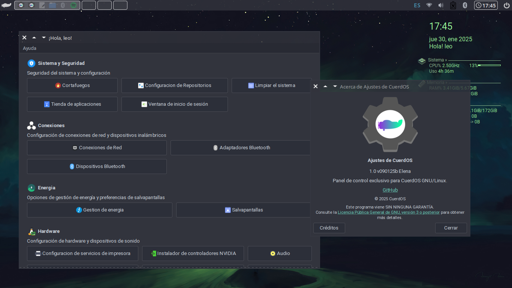

# CuerdOS Settings

<p align="center">
  
</p>

<p align="center">
  
</p>


**CuerdOS Settings** es una aplicación de configuración para **CuerdOS GNU/Linux**, diseñada para proporcionar una interfaz gráfica intuitiva para la gestión de opciones del sistema. Está basada en **Python 3** y soporta tanto **GTK** como **Qt**, permitiendo una integración fluida con distintos entornos de escritorio (DE) y principalmente gestores de ventana (WM).

## Características

- Configuración unificada del sistema.
- Soporte para **GTK** y **Qt**.
- Interfaz intuitiva y fácil de usar.
- Módulos configurables y personalizables.
- Integración con herramientas del sistema.

## Requisitos

- **CuerdOS GNU/Linux o Cualquier Distribucion base Debian**
- **Python 3.x**
- **GTK 3.0** o **Qt 5+**
- **Dependencias:** `python3`, `python3-gi`
- **Paquetes recomendados:** `jamesdsp`, `nitrogen`, `nwg-look`, `bleachbit`, `bauh`, `firewall-config`, `blueman`, `cups`, `ibus`, `qt5ct`, `xfce4-power-manager`, `xfce4-screensaver`, `gnome-disks`, `hardinfo`, `orage`, `font-manager`, `lightdm-settings`, `conkyman`, `pavucontrol`, `nvidia-installer`, `nm-connection-editor`, `arandr`, `wdisplays`

## Instalación

Puedes clonar el repositorio y ejecutar la aplicación directamente:

```bash
git clone https://github.com/gatoverde95/CuerdOS-Settings.git
cd CuerdOS-Settings
python3 settings.py
```

## Uso

1. Ejecuta `python3 settings.py`.
2. Explora las opciones de configuración disponibles.
3. Ajusta los parámetros según tus necesidades.

## Contribuir

Si deseas colaborar en el desarrollo de **CuerdOS Settings**, síguenos en [GitHub](https://github.com/gatoverde95/CuerdOS-Settings) y envía tus **Pull Requests** o reporta errores en la sección de **Issues**.

## Licencia

Este proyecto está licenciado bajo la **GPLv3**. Puedes consultar el archivo `LICENSE` para más información.

---

> **Autor:** [gatoverde95](https://github.com/gatoverde95)  
> **Repositorio:** [CuerdOS Settings](https://github.com/gatoverde95/CuerdOS-Settings)
